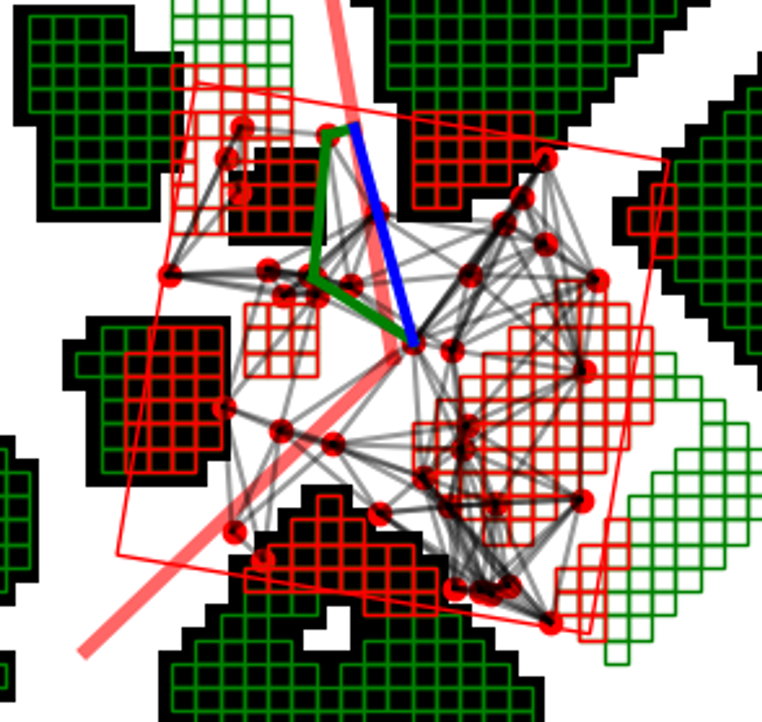
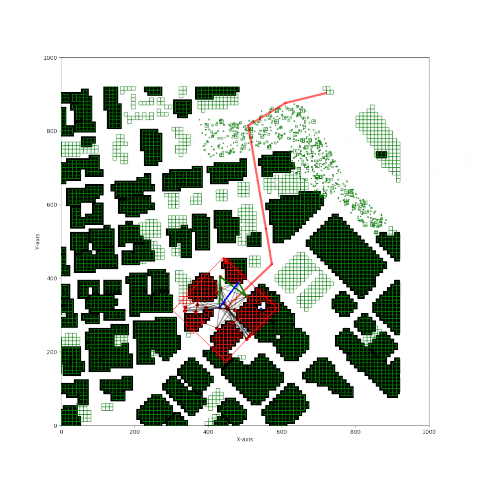

# Submission overview

There are two path planners implemented in this project. The first one is a planner for full global path which uses Voronoi algorithm and the second one is a horizon planner which uses probabilistic approach for building local paths between global path points.
Of Course there is no reason for horizon planner to be used in this project, but it is implemented for educational purposes.

### Global path planner
The global path planner is implemented in `global_path_planner.py` file. It uses Voronoi algorithm to build a graph of the environment and then uses A* algorithm to find the shortest path between start and goal points. The _graph_ and _grid_ is built using `create_voronoi_grid_and_edges` function which creates a 2D grid of the environment and Voronoi graph edges. Method `_graph_voronoi_planing` builds global path with the next steps:
 - Create graph from edges.
 - Find nearest nodes to start and goal points.
 - Use `a_star_graph` function to find the shortest path between start and goal .
 - Prune path using `prune_path_bresenham` function which uses conservative bresenham algorithm to remove unnecessary waypoints.
   

#### Global path planner result:


### Horizon path planner
The horizon path planner is implemented in `horizon_path_planner.py` file. It builds a path between two point which are used to create a vector of horizon frame orientation and position. Horizon planner also uses A* algorithm to find the shortest path between start and goal points. `create_local_path` method creates a local path between two points using probabilistic approach with the next steps:
 - Create a horizon frame and **samples** using `create_horizon_frame_with_samples` method with next steps:
   - find a **vector** between start and goal points;
   - create a **frame** with center at start point and orientation of the **vector**;
   - create a set of random **samples** in the **frame**;
 - find polygons which are intersected by the **frame**;
 - find **samples** inside frame which are not intersected by the polygons with `filter_samples` function;
 - create a graph from **samples** using KDTree with `create_graph` function;
 - find nearest nodes to start and goal points with `closest_node_graph` function;
 - use `a_star_graph` function to find the shortest path between start and goal nodes in the graph;
 - prune path using `prune_path_3d` function which removes unnecessary waypoints.
    
    - red rectangle is the horizon **frame**;
    - red rectangles are polygons which are intersected by the horizon **frame**;
    - red points are **samples** which are not intersected by the polygons and are used to build a graph;
    - transparent black lines are **edges** of the graph;
    - green bold line is the **path** between start and goal points;
    - blue bold line is the final **pruned path**.

#### Horizon path planner result:


### Constants for planning
Due to the issues with the simulator and performance of the planners in DEBUG mode and after connecting to the simulator, the following constants in the `planning_constants.py` file are used to control the planning process:
 - `PRE_PLANNING` - if `True` both planners will be executed before connecting to the simulator;
 - `USE_HORIZON_PLANNER` - if `True` the horizon planner will be used, otherwise the global planner will be used only;
 - `RUN_DRONE` - if `True` the drone will be executed after connecting to the simulator. With pre-planned path or with the path from the planners during flight.


# FCND - 3D Motion Planning


This project is a continuation of the Backyard Flyer project where you executed a simple square shaped flight path. In this project you will integrate the techniques that you have learned throughout the last several lessons to plan a path through an urban environment. Check out the [project rubric](https://review.udacity.com/#!/rubrics/1534/view) for more detail on what constitutes a passing submission.

## Option to do this project in a GPU backed virtual machine in the Udacity classroom!
Rather than downloading the simulator and starter files you can simply complete this project in a virual workspace in the Udacity classroom! Follow [these instructions](https://classroom.udacity.com/nanodegrees/nd787/parts/5aa0a956-4418-4a41-846f-cb7ea63349b3/modules/0c12632a-b59a-41c1-9694-2b3508f47ce7/lessons/5f628104-5857-4a3f-93f0-d8a53fe6a8fd/concepts/ab09b378-f85f-49f4-8845-d59025dd8a8e?contentVersion=1.0.0&contentLocale=en-us) to proceed with the VM. 

## To complete this project on your local machine, follow these instructions:
### Step 1: Download the Simulator
This is a new simulator environment!  

Download the Motion-Planning simulator for this project that's appropriate for your operating system from the [simulator releases respository](https://github.com/udacity/FCND-Simulator-Releases/releases).

### Step 2: Set up your Python Environment
If you haven't already, set up your Python environment and get all the relevant packages installed using Anaconda following instructions in [this repository](https://github.com/udacity/FCND-Term1-Starter-Kit)

### Step 3: Clone this Repository
```sh
git clone https://github.com/udacity/FCND-Motion-Planning
```
### Step 4: Test setup
The first task in this project is to test the [solution code](https://github.com/udacity/FCND-Motion-Planning/blob/master/backyard_flyer_solution.py) for the Backyard Flyer project in this new simulator. Verify that your Backyard Flyer solution code works as expected and your drone can perform the square flight path in the new simulator. To do this, start the simulator and run the [`backyard_flyer_solution.py`](https://github.com/udacity/FCND-Motion-Planning/blob/master/backyard_flyer_solution.py) script.

```sh
source activate fcnd # if you haven't already sourced your Python environment, do so now.
python backyard_flyer_solution.py
```
The quad should take off, fly a square pattern and land, just as in the previous project. If everything functions as expected then you are ready to start work on this project. 

### Step 5: Inspect the relevant files
For this project, you are provided with two scripts, `motion_planning.py` and `planning_utils.py`. Here you'll also find a file called `colliders.csv`, which contains the 2.5D map of the simulator environment. 

### Step 6: Explain what's going on in  `motion_planning.py` and `planning_utils.py`

`motion_planning.py` is basically a modified version of `backyard_flyer.py` that leverages some extra functions in `planning_utils.py`. It should work right out of the box.  Try running `motion_planning.py` to see what it does. To do this, first start up the simulator, then at the command line:
 
```sh
source activate fcnd # if you haven't already sourced your Python environment, do so now.
python motion_planning.py
```

You should see the quad fly a jerky path of waypoints to the northeast for about 10 m then land.  What's going on here? Your first task in this project is to explain what's different about `motion_planning.py` from the `backyard_flyer_solution.py` script, and how the functions provided in `planning_utils.py` work. 

### Step 7: Write your planner

Your planning algorithm is going to look something like the following:

- Load the 2.5D map in the `colliders.csv` file describing the environment.
- Discretize the environment into a grid or graph representation.
- Define the start and goal locations. You can determine your home location from `self._latitude` and `self._longitude`. 
- Perform a search using A* or other search algorithm. 
- Use a collinearity test or ray tracing method (like Bresenham) to remove unnecessary waypoints.
- Return waypoints in local ECEF coordinates (format for `self.all_waypoints` is [N, E, altitude, heading], where the drone’s start location corresponds to [0, 0, 0, 0]). 

Some of these steps are already implemented for you and some you need to modify or implement yourself.  See the [rubric](https://review.udacity.com/#!/rubrics/1534/view) for specifics on what you need to modify or implement.

### Step 8: Write it up!
When you're finished, complete a detailed writeup of your solution and discuss how you addressed each step. You can use the [`writeup_template.md`](./writeup_template.md) provided here or choose a different format, just be sure to describe clearly the steps you took and code you used to address each point in the [rubric](https://review.udacity.com/#!/rubrics/1534/view). And have fun!

## Extra Challenges
The submission requirements for this project are laid out in the rubric, but if you feel inspired to take your project above and beyond, or maybe even keep working on it after you submit, then here are some suggestions for interesting things to try.

### Try flying more complex trajectories
In this project, things are set up nicely to fly right-angled trajectories, where you ascend to a particular altitude, fly a path at that fixed altitude, then land vertically. However, you have the capability to send 3D waypoints and in principle you could fly any trajectory you like. Rather than simply setting a target altitude, try sending altitude with each waypoint and set your goal location on top of a building!

### Adjust your deadbands
Adjust the size of the deadbands around your waypoints, and even try making deadbands a function of velocity. To do this, you can simply modify the logic in the `local_position_callback()` function.

### Add heading commands to your waypoints
This is a recent update! Make sure you have the [latest version of the simulator](https://github.com/udacity/FCND-Simulator-Releases/releases). In the default setup, you're sending waypoints made up of NED position and heading with heading set to 0 in the default setup. Try passing a unique heading with each waypoint. If, for example, you want to send a heading to point to the next waypoint, it might look like this:

```python
# Define two waypoints with heading = 0 for both
wp1 = [n1, e1, a1, 0]
wp2 = [n2, e2, a2, 0]
# Set heading of wp2 based on relative position to wp1
wp2[3] = np.arctan2((wp2[1]-wp1[1]), (wp2[0]-wp1[0]))
```

This may not be completely intuitive, but this will yield a yaw angle that is positive counterclockwise about a z-axis (down) axis that points downward.

Put all of these together and make up your own crazy paths to fly! Can you fly a double helix?? 


Ok flying a double helix might seem like a silly idea, but imagine you are an autonomous first responder vehicle. You need to first fly to a particular building or location, then fly a reconnaissance pattern to survey the scene! Give it a try!